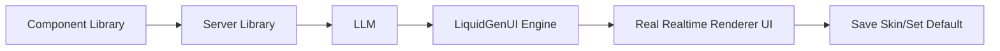

<div align="center">

<a href="https://your-crm-demo.vercel.app" target="_blank" rel="noopener noreferrer">
  <picture>
    <source media="(prefers-color-scheme: dark)" srcset="https://github.com/user-attachments/assets/f1a5910c-3fe1-4876-8850-a5a1e4436845">
    
  </picture>
</a>


# LiquidGenUI — El motor de Generative UI en tiempo real para React

[](https://www.npmjs.com/package/liquid-genui-react)
[](https://www.npmjs.com/package/liquid-genui-server)
[](https://liquidgenui.vercel.app/)
[](https://uni-airlines.vercel.app/)
[](./LICENSE)

</div>

**LiquidGenUI** es un framework de Generative UI experimental, *local-first*, para React y Node.js. Te permite mutar instantáneamente interfaces legacy, desactualizadas o básicas a componentes modernos y de alta fidelidad en tiempo de ejecución (runtime) usando el poder de la IA Generativa.

Sin CSS hardcodeado, sin layouts estáticos. Solo generación de UI fluida y en tiempo real, mapeada de forma segura a los endpoints de tu base de datos.

---

<div align="center">

[Live Demo](https://your-crm-demo.vercel.app) · [NPM Packages](https://www.npmjs.com/package/liquid-genui-react) · [English](./README.md) · Leer en Español 🇪🇸

</div>

---

## ¿Qué es LiquidGenUI?

<div align="center">

</div>

En el corazón de LiquidGenUI hay un poderoso cambio de paradigma: **la UI como un estado fluido**. En lugar de tratar a un LLM como un chatbot de texto, LiquidGenUI lo usa como un motor de renderizado en tiempo real.

**Capacidades principales:**
- **Runtime Local-First** — Impulsado por `Dexie` (IndexedDB) para el almacenamiento instantáneo de skins y renderizado con latencia cero a través de recargas (reloads).
- **Mutaciones Fluidas en Tiempo Real** — Intercambio (swapping) de skins sin interrupciones en runtime impulsado por `framer-motion`.
- **Orquestación Agnóstica de LLMs** — Construido sobre el Vercel AI SDK. Soporte nativo para los modelos Gemini, OpenAI, Mistral, Grok, DeepSeek, Anthropic y NIM de Nvidia.
- **Backend Skill Registry** — Mapea de forma segura los endpoints de tu API REST de la base de datos para que la IA pueda ejecutarlos de forma nativa.

## Quick Start

La forma más rápida de empezar es instalando tanto el provider de React como el engine del Server:

```bash
# Instalar el Frontend Package
npm install liquid-genui-react

# Instalar el Backend Package
npm install liquid-genui-server
```

## Cómo funciona

Tus componentes definen qué Skills e información puede usar el modelo configurado en tu back-end y generan la UI con librerías seguras.



1. Configura tu componente con LiquidGenUI y personaliza tus endpoints.
2. Configura tu back-end con un endpoint de LiquidGenUI.
3. Describe tu nueva UI en lenguaje natural (natural language prompt).
4. Envía ese prompt con el botón GEN al back-end.
5. Haz streaming de la respuesta de LiquidGenUI de vuelta al cliente.
6. Renderiza la respuesta progresivamente con LiquidGenUI Engine.
7. Guarda tus skins y asigna tu favorito como default.

## Por qué LiquidGenUI

LiquidGenUI está diseñado para mutaciones de UI en runtime que necesitan ser fluidas, persistentes y estar perfectamente sincronizadas con tu backend.

- **Caché de Latencia Cero** — Ahorra cantidades masivas de tokens de LLM. Una vez que se genera un skin, puedes guardarlo, almacenándose localmente a través de Dexie (IndexedDB) para un renderizado instantáneo en futuras visitas sin llamar a la IA nuevamente.
- **Secure Skill Registry** — Restringe lo que puede hacer la IA. Mapea tus endpoints de la API REST a "Skills" explícitas para que el modelo pueda obtener (fetch) o mutar datos de forma segura sin tocar nunca la estructura raw de tu base de datos.
- **Orquestación Agnóstica** — No te ates (vendor lock-in) a un solo proveedor. Intercambia dinámicamente entre Gemini, Mistral, Grok, OpenAI o Nvidia NIM a través de nuestro wrapper backend unificado del Vercel AI SDK.

### Modelos soportados

Google, OpenAi, DeepSeek, Mistral, xAi & Anthropic - 
<a href="https://vercel.com/ai-gateway/models" target="_blank" rel="noopener noreferrer">
  Ver vercel Browse AI
</a>

NIM Models -
<a href="https://build.nvidia.com/models" target="_blank" rel="noopener noreferrer">
  Ver Modelos de nvidia
</a>

## Documentation

**MyStaticApp.tsx**
<details>
<summary><b>Ver código completo</b></summary>
  
```tsx
export const useInventorySkills = () => {
  const [items, setItems] = useState<Item[]>([]);

  const loadItems = async () => {
    const res = await fetch("/api/items");
    const data = await res.json();
    setItems(data);
    return data;
  };

  useEffect(() => {
    loadItems();
  }, []);

  {/* Your App Skills */}
  const systemSkills = {
    fetch_items: async () => {
      return await loadItems();
    },
    create_item: async (payload: { name: string; quantity: number }) => {
      const res = await fetch("/api/items", {
        method: "POST",
        headers: { "Content-Type": "application/json" },
        body: JSON.stringify(payload),
      });
      await loadItems();
      return await res.json();
    },
    update_item: async (payload: { id: number; name: string; quantity: number }) => {
      const res = await fetch(`/api/items/${payload.id}`, {
        method: "PUT",
        headers: { "Content-Type": "application/json" },
        body: JSON.stringify(payload),
      });
      await loadItems();
      return await res.json();
    },
    delete_item: async (payload: { id: number }) => {
      const res = await fetch(`/api/items/${payload.id}`, {
        method: "DELETE",
      });
      await loadItems();
      return await res.json();
    },
  };

  return { items, loadItems, systemSkills };
};

{/* Your Skills configuration */}
export const configSkills = [
  { tag: "fetch_items" },
  { tag: "create_item", payload: { name: "string", quantity: "number" } },
  { tag: "update_item", payload: { id: "number", name: "string", quantity: "number" } },
  { tag: "delete_item", payload: { id: "number" } }
];
```
</details>

**App.tsx**
<details>
<summary><b>Ver código completo</b></summary>
  
```tsx
import {
  LiquidProvider,
  LiquidCanvas,
  LiquidChat,
  DefaultSkin
} from "liquid-genui-react";
import { MyStaticApp, useMyStaticAppSkills, configSkills } from "./MyStaticApp";

{/* Your custom endpoints */}
const engineConfig = {
  apiEndpoint: '/api/generate-ui-stream', 
  saveSkinRemoteApiEndpoint: '/api/skins',
  getSkinsRemoteApiEndpoint: '/api/skins',
  deleteSkinRemoteApiEndpoint: '/api/skins',
  skills: configSkills,
};

const { items, loadItems, systemSkills } = useMyStaticAppSkills();

<LiquidProvider 
  config={engineConfig}
  skills={systemSkills}
>
  {/* Your raw static boring site */}
  <DefaultSkin component={MyStaticApp} items={items} loadItems={loadItems}/>
  {/* Where magic happens */}
  <LiquidCanvas items={items} />
  <LiquidChat />
</LiquidProvider>
```
</details>

**server.ts**
<details>
<summary><b>Ver código completo</b></summary>
  
```ts
import { 
  generateLiquidUI, 
  generateLiquidUIStream, 
  type LiquidServerConfig 
} from "liquid-genui-server";

{/* LiquidGenUI Stream Endpoint */}
app.post('/api/generate-ui-stream', async (req, res) => {
  try {
    res.setHeader('Content-Type', 'text/event-stream');
    res.setHeader('Cache-Control', 'no-cache');
    res.setHeader('Connection', 'keep-alive');
    res.setHeader('X-Accel-Buffering', 'no');
    res.flushHeaders();

    const { prompt, data, availableSkills, currentHtml } = req.body;
    const config: LiquidServerConfig = {
      service: "google", // You can use 'nvidia' to use NIM models or (google, openai, deepseek, mistral, xai, anthropic)
      model: "gemini-3-flash-preview", // Add your NIM models using the full model name: deepseek-ai/deepseek-v4-pro or (gemini-3.1-pro-preview, gpt-5.5-pro-2026-04-23...)

      {/* Add your additional custom SafeLibraries using addSafeLibraries (optional) */}
      {/* Or use your own libraries by adding your list with safeLibraries (optional) */}
      addSafeLibraries: [
        {
          category: 'styles',
          libs: [{ name: 'custom-library', src: '<script src="https://unpkg.com/custom-library@1.0.0"></script>' }]
        }
      ]
    };

    const stream = generateLiquidUIStream({ prompt, data, availableSkills, currentHtml }, config);

    for await (const chunk of stream) {
      res.write(`data: ${JSON.stringify({ chunk })}\n\n`);
    }
    res.write('data: [DONE]\n\n');
    res.end();
  } catch (error: any) {
    console.error('Generative UI Stream Error:', error);
    res.write(`data: ${JSON.stringify({ error: error.message || 'Error generating UI' })}\n\n`);
    res.end();
  }
});
```
</details>


## Licencia

Este proyecto está disponible bajo los términos descritos en [`LICENSE`](./LICENSE).
