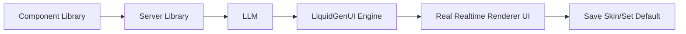

<div align="center">

<a href="https://your-crm-demo.vercel.app" target="_blank" rel="noopener noreferrer">
  <picture>
    <source media="(prefers-color-scheme: dark)" srcset="https://github.com/user-attachments/assets/f1a5910c-3fe1-4876-8850-a5a1e4436845">
    
  </picture>
</a>


# LiquidGenUI — The Generative UI Engine in realtime for React

[](https://www.npmjs.com/package/liquid-genui-react)
[](https://www.npmjs.com/package/liquid-genui-server)
[](https://liquidgenui.vercel.app/)
[](https://uni-airlines.vercel.app/)
[](./LICENSE)

</div>

**LiquidGenUI** is an experimental, local-first Generative UI framework for React and Node.js. It allows you to instantly mutate legacy, outdated, or basic interfaces into modern, high-fidelity components at runtime using the power of Generative AI. 

No hardcoded CSS, no static layouts. Just fluid, real-time UI generation mapped safely to your actual database endpoints.

---

<div align="center">

[Live Demo](https://your-crm-demo.vercel.app) · [NPM Packages](https://www.npmjs.com/package/liquid-genui-react) · English · [Leer en Español 🇪🇸](./README.es.md)

</div>

---

## What is LiquidGenUI?

<div align="center">

</div>

At the core of LiquidGenUI is a powerful paradigm shift: **UI as a fluid state**. Instead of treating an LLM as a text chatbot, LiquidGenUI uses it as a real-time rendering engine. 

**Core capabilities:**
- **Local-First Runtime** — Powered by `Dexie` (IndexedDB) for instant skin storage and zero-latency rendering across reloads.
- **Real-Time Fluid Mutations** — Seamless skin swapping at runtime powered by `framer-motion`.
- **Agnostic LLM Orchestration** — Built on top of the Vercel AI SDK. Native support for Gemini, OpenAI, Mistral, Grok, DeepSeek, Anthropic, and Nvidia's NIM models.
- **Backend Skill Registry** — Safely map endpoints of your REST API database so the AI can execute them natively.

## Quick Start

The fastest way to get started is by installing both the React provider and the Server engine:

```bash
# Install the Frontend Package
pnpm install liquid-genui-react

# Install the Backend Package
pnpm install liquid-genui-server
```

## How it works

Your components define what skills and information the configured model can use in your back-end and generate the UI with secure libraries.



1. Configure your component with Liquid GenUI and customize your endpoints.
2. Configure your back-end with a LiquidGenUI enpoint.
3. Describe your new UI in natural language.
4. Send that prompt with GEN button to back-end.
5. Stream LiquidGenUI output back to the client.
6. Render the output progressively with LiquidGenUI Engine.
7. Save your skins and assign your favorite as the default.

## Why LiquidGenUI

LiquidGenUI is designed for runtime UI mutations that need to be fluid, persistent, and perfectly synced with your backend.

- **Zero-Latency Caching** — Save massive amounts of LLM tokens. Once a skin is generated, you can save it is stored locally via dexie (IndexedDB) for instant rendering on future visits without calling the AI again.
- **Secure Skill Registry** — Restrict what the AI can do. Map your REST API endpoints to explicit "Skills" so the model can fetch or mutate data safely without ever touching your raw database structure.
- **Agnostic Orchestration** — Don't get locked into a single provider. Swap between Gemini, Mistral, Grok, OpenAI, or Nvidia NIM dynamically through our unified Vercel AI SDK backend wrapper.

### Supported models

Google, OpenAi, DeepSeek, Mistral, xAi & Anthropic - 
<a href="https://vercel.com/ai-gateway/models" target="_blank" rel="noopener noreferrer">
  View vercel Browse AI
</a>

NIM Models -
<a href="https://build.nvidia.com/models" target="_blank" rel="noopener noreferrer">
  View nvidia Models
</a>

## Documentation 

**MyStaticApp.tsx**
<details>
<summary><b>View full code</b></summary>
  
```tsx
export const useMyPageSkills = () => {
  const [items, setItems] = useState<Item[]>([]);

  const loadItems = async () => {
    const res = await fetch("/api/items");
    const data = await res.json();
    setItems(data);
    return data;
  };

  useEffect(() => {
    loadItems();
  }, []);

  {/* Your App Skills */}
  const systemSkills = {
    fetch_items: async () => {
      return await loadItems();
    },
    create_item: async (payload: { name: string; quantity: number }) => {
      const res = await fetch("/api/items", {
        method: "POST",
        headers: { "Content-Type": "application/json" },
        body: JSON.stringify(payload),
      });
      await loadItems();
      return await res.json();
    },
    update_item: async (payload: { id: number; name: string; quantity: number }) => {
      const res = await fetch(\`/api/items/\${payload.id}\`, {
        method: "PUT",
        headers: { "Content-Type": "application/json" },
        body: JSON.stringify(payload),
      });
      await loadItems();
      return await res.json();
    },
    delete_item: async (payload: { id: number }) => {
      const res = await fetch(\`/api/items/\${payload.id}\`, {
        method: "DELETE",
      });
      await loadItems();
      return await res.json();
    },
  };

  return { items, loadItems, systemSkills };
};

{/* Your Skills configuration */}
export const configSkills = [
  { tag: "fetch_items", responseSchema: [{ id: "number", name: "string", quantity: "string"}], skillDescription: "Get all products" },
  { tag: "create_item", payload: { name: "string", quantity: "number" }, skillDescription: "Create a new product" },
  { tag: "update_item", payload: { id: "number", name: "string", quantity: "number" }, skillDescription: "Update a product" },
  { tag: "delete_item", payload: { id: "number" }, skillDescription: "Delete a product" }
];

{/* Your Page importants descriptions */}
export const projectRequeriments = "My page name its InventoryProUltra, get inventory items with quantity..."

{/* Your page */}
export function MyPage({
    items,
    loadItems,
}: {
    items: Item[];
    loadItems: () => void;

}) {...}
```
</details>

**App.tsx**
<details>
<summary><b>View full code</b></summary>
  
```tsx
import 'liquid-genui-react/dist/style.css';
import {
  LiquidProvider,
  LiquidCanvas,
  LiquidChat,
  DefaultSkin
} from "liquid-genui-react";
import { MyPage, useMyPageSkills, configSkills, projectRequeriments, loadItems, projectId, API_BASE } from "./MyPage";

export default function App() {
  const { items, loadItems, systemSkills } = useMyPageSkills();

  {/* Your custom endpoints */}
  const engineConfig = {
      projectId: projectId,
      projectRequeriments: projectRequeriments,
      apiEndpoint: `${API_BASE}/api/generate-ui-stream`
      saveSkinRemoteApiEndpoint: `${API_BASE}/api/skins`
      getSkinsRemoteApiEndpoint: `${API_BASE}/api/skins`
      deleteSkinRemoteApiEndpoint: `${API_BASE}/api/skins`
      skills: configSkills,
  };

  return (<LiquidProvider config={engineConfig} skills={systemSkills}>
    {/* Your raw static boring site 👇 */}
    <DefaultSkin component={MyPage} items={items} loadItems={loadItems}/>
    {/* Where magic happens 👇 */}
    <LiquidCanvas items={items} />
    <LiquidChat />
  </LiquidProvider>
```
</details>

**server.ts**
<details>
<summary><b>View full code</b></summary>
  
```ts
import { generateLiquidUIStream, type LiquidServerConfig } from "liquid-genui-server";

// --- Endpoint de Generación UI por Streaming ---
app.post('/api/generate-ui-stream', async (req, res) => {
res.setHeader('Content-Type', 'text/event-stream');
res.setHeader('Cache-Control', 'no-cache');
res.setHeader('Connection', 'keep-alive');

    const { prompt, data, availableSkills, currentHtml, projectRequeriments } = req.body;
    const config: LiquidServerConfig = {
      service: "google", // You can use 'nvidia' to use NIM models or (openai, deepseek, mistral, xai, anthropic)
      model: "gemini-3-flash-preview", // Add your NIM models using the full model name: deepseek-ai/deepseek-v4-pro or (gemini-3.1-pro-preview, gpt-5.5-pro-2026-04-23...)

      {/* Add your additional custom SafeLibraries using addSafeLibraries (optional)*/}
      {/* Or use your own libraries by adding your list with safeLibraries (optional) */}
      addSafeLibraries: [
        {
          category: 'styles',
          libs: [{ name: 'custom-library', src: '<script src="https://unpkg.com/custom-library@1.0.0"></script>' }]
        }
      ]
    };

    const stream = generateLiquidUIStream({ prompt, data, availableSkills, currentHtml, projectRequeriments }, config);
    for await (const chunk of stream) {
      res.write(`data: ${JSON.stringify({ chunk })}`);
    }
    res.write('data: [DONE]');
    res.end();
  } catch (error: any) {
    console.error('Generative UI Stream Error:', error);
    res.write(`data: ${JSON.stringify({ error: error.message || 'Error generating UI' })}`);
    res.end();
  }
});
```
</details>

**Endpoints to Save Skins**
<details>
<summary><b>View full code</b></summary>

```ts
// --- Skins Endpoints ---
app.get("/api/skins", async (req, res) => {
  try {
    const projectId = req.query.projectId as string;
    if (!projectId) {
      return res.status(400).json({ error: "projectId is required" });
    }
    const result = await db.execute({
      sql: "SELECT * FROM skins WHERE projectId = ? ORDER BY created_at DESC",
      args: [projectId]
    });
    res.json(result.rows);
  } catch (err: any) {
    res.status(500).json({ error: err.message });
  }
});

app.post("/api/skins", async (req, res) => {
  try {
    const { id, name, html, prompt, projectId } = req.body;
    if (!id || !name || !html || !projectId) {
      return res.status(400).json({ error: "id, name, html and projectId required" });
    }
    await db.execute({
      sql: "INSERT OR REPLACE INTO skins (id, name, html, prompt, projectId) VALUES (?, ?, ?, ?, ?)",
      args: [id, name, html, prompt || null, projectId]
    });
    const newSkinResult = await db.execute({
      sql: "SELECT * FROM skins WHERE id = ?",
      args: [id]
    });
    res.json(newSkinResult.rows[0]);
  } catch (err: any) {
    res.status(500).json({ error: err.message });
  }
});

app.delete("/api/skins/:id", async (req, res) => {
  try {
    const id = req.params.id;
    await db.execute({
      sql: "DELETE FROM skins WHERE id = ?",
      args: [id]
    });
    res.json({ success: true, deleted_id: id });
  } catch (err: any) {
    res.status(500).json({ error: err.message });
  }
});

// Example table creation
await db.execute("
  CREATE TABLE IF NOT EXISTS skins (
    id TEXT PRIMARY KEY,
    name TEXT NOT NULL,
    html TEXT NOT NULL,
    prompt TEXT,
    projectId TEXT,
    created_at DATETIME DEFAULT CURRENT_TIMESTAMP
  );
");
```
</details>

**Environment Variables (API Keys)**
```txt
GOOGLE_GENERATIVE_AI_API_KEY="MI_API_KEY"
NIM_API_KEY="MI_API_KEY"
ANTHROPIC_API_KEY="MI_API_KEY"
XAI_API_KEY="MI_API_KEY"
DEEPSEEK_API_KEY="MI_API_KEY"
MISTRAL_API_KEY="MI_API_KEY"
OPENAI_API_KEY="MI_API_KEY"
```
<a href="https://liquidgenui.vercel.app/docs" target="_blank" rel="noopener noreferrer">
  View full documentation
</a>

## License

This project is available under the terms described in [`LICENSE`](./LICENSE).
