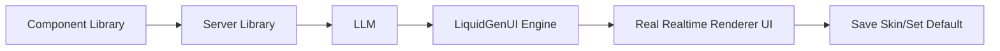

<div align="center">

<a href="https://your-crm-demo.vercel.app" target="_blank" rel="noopener noreferrer">
  <picture>
    <source media="(prefers-color-scheme: dark)" srcset="https://github.com/user-attachments/assets/f1a5910c-3fe1-4876-8850-a5a1e4436845">
    
  </picture>
</a>


# LiquidGenUI — The Generative UI Engine in realtime for React

[](https://www.npmjs.com/package/liquid-genui-react)
[](./LICENSE)
[](https://your-crm-demo.vercel.app)

</div>

**LiquidGenUI** is an experimental, local-first Generative UI framework for React and Node.js. It allows you to instantly mutate legacy, outdated, or basic interfaces into modern, high-fidelity components at runtime using the power of Generative AI. 

No hardcoded CSS, no static layouts. Just fluid, real-time UI generation mapped safely to your actual database endpoints.

---

<div align="center">

[Live Demo](https://your-crm-demo.vercel.app) · [NPM Packages](https://www.npmjs.com/package/liquid-genui-react) · English · [Leer en Español 🇪🇸](./README.es.md)

</div>

---

## What is LiquidGenUI?

<div align="center">

</div>

At the core of LiquidGenUI is a powerful paradigm shift: **UI as a fluid state**. Instead of treating an LLM as a text chatbot, LiquidGenUI uses it as a real-time rendering engine. 

**Core capabilities:**
- **Local-First Runtime** — Powered by `Dexie` (IndexedDB) for instant skin storage and zero-latency rendering across reloads.
- **Real-Time Fluid Mutations** — Seamless skin swapping at runtime powered by `framer-motion`.
- **Agnostic LLM Orchestration** — Built on top of the Vercel AI SDK. Native support for Gemini, OpenAI, Mistral, Grok, DeepSeek, Anthropic, and Nvidia's NIM models.
- **Backend Skill Registry** — Safely map endpoints of your REST API database so the AI can execute them natively.

## Quick Start

The fastest way to get started is by installing both the React provider and the Server engine:

```bash
# Install the Frontend Package
npm install liquid-genui-react

# Install the Backend Package
npm install liquid-genui-server
```

## How it works

Your components define what skills and information the configured model can use in your back-end and generate the UI with secure libraries.



1. Configure your component with Liquid GenUI and customize your endpoints.
2. Configure your back-end with a LiquidGenUI enpoint.
3. Describe your new UI in natural language.
4. Send that prompt with GEN button to back-end.
5. Stream LiquidGenUI output back to the client.
6. Render the output progressively with LiquidGenUI Engine.
7. Save your skins and assign your favorite as the default.

## Why LiquidGenUI

LiquidGenUI is designed for runtime UI mutations that need to be fluid, persistent, and perfectly synced with your backend.

- **Zero-Latency Caching** — Save massive amounts of LLM tokens. Once a skin is generated, you can save it is stored locally via dexie (IndexedDB) for instant rendering on future visits without calling the AI again.
- **Secure Skill Registry** — Restrict what the AI can do. Map your REST API endpoints to explicit "Skills" so the model can fetch or mutate data safely without ever touching your raw database structure.
- **Agnostic Orchestration** — Don't get locked into a single provider. Swap between Gemini, Mistral, Grok, OpenAI, or Nvidia NIM dynamically through our unified Vercel AI SDK backend wrapper.

### Supported models

<a href="https://vercel.com/ai-gateway/models" target="_blank" rel="noopener noreferrer">
  View vercel Browse AI
</a>


## License

This project is available under the terms described in [`LICENSE`](./LICENSE).